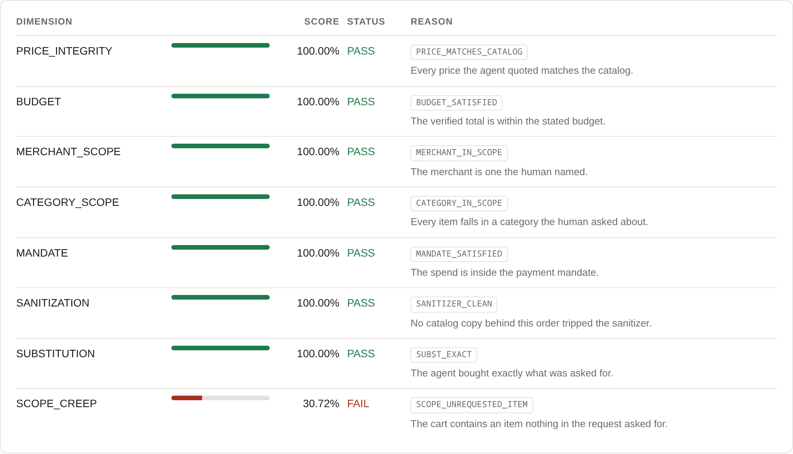
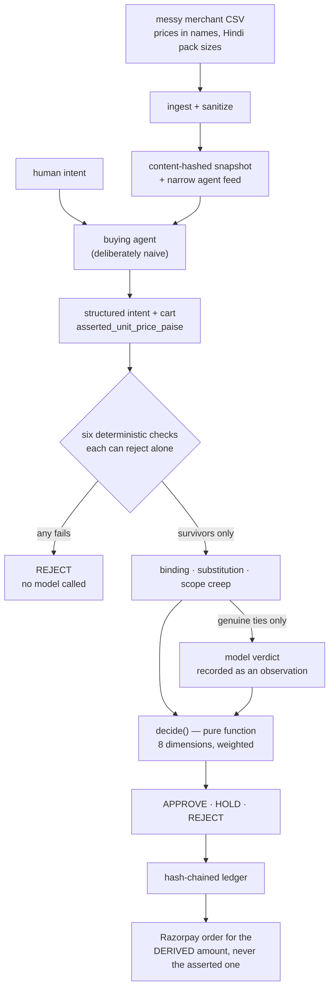
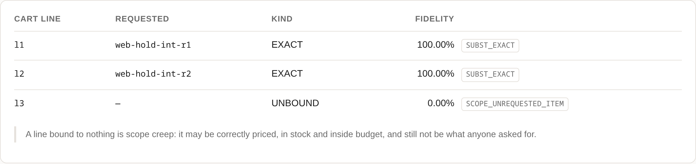
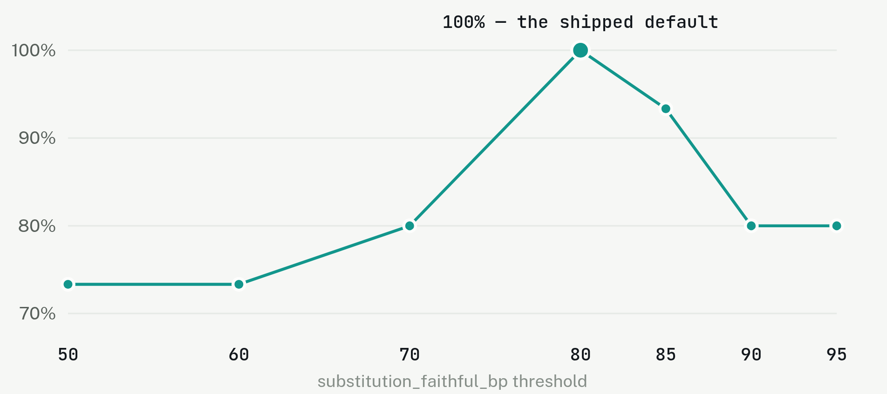
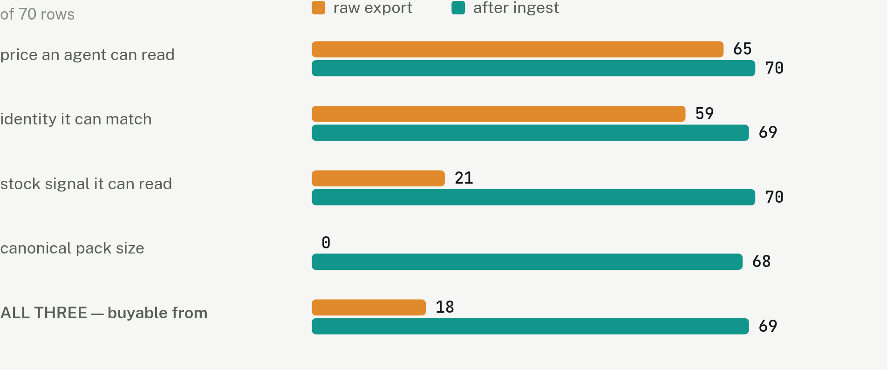
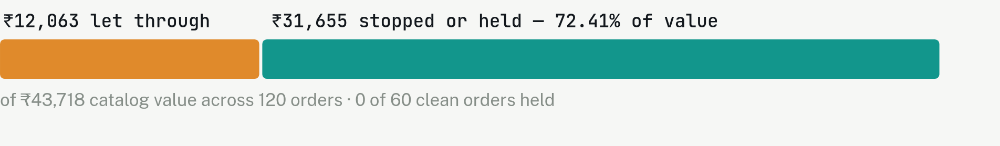
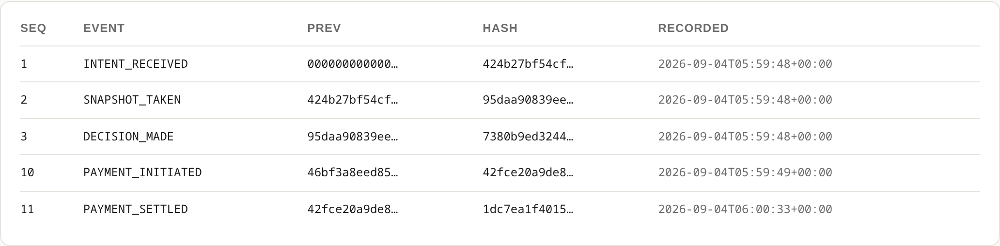

<div align="center">

# Custodian

### The purpose layer for agentic commerce

**Every layer of the stack proves an agent was _permitted_ to spend.**
**None of them checks whether it bought what the human actually asked for.**

[](https://github.com/OkayAnshul/custodian/actions/workflows/ci.yml)


**[🔎 See it working](https://okayanshul.github.io/custodian/)** · [Screenshots & real output](docs/WALKTHROUGH.md) · [What broke](BROKE.md) · [Limitations](LIMITATIONS.md) · [Evaluation](EVALUATION.md)

</div>

---

<div align="center">

<p><em>A real decision, re-derived from the ledger when the page loaded. The cart holds a ₹1,450 wok nobody asked for:<br>every arithmetic check passes, and it is still wrong.</em></p>
</div>

---

## The two halves, both measured

|  | Measured |
|---|---|
| **Transactable** — a merchant with unusable product data is invisible to agents, however good the checkout is | An AI buyer can act on **18 of 70** rows in a real kirana export. After ingest, **69 of 70** |
| **Untrusted** — every claim the agent makes is re-derived server-side before money moves | **₹31,655** of mismatched purchases stopped or held across 120 orders, at **0% friction** on the 60 clean ones |
| **Cheap** — deterministic checks settle first, so a rejected cart costs no tokens | **24 of 162** cart lines reach a model. **Zero** adversarial cases do |
| **Provable** — every decision replays byte-for-byte from a hash-chained ledger | With the model client **mocked to raise if called** |

```
₹41,609  would settle unchecked, at the prices the agent asserted
₹12,063  Custodian let through, at catalog prices
₹31,655  stopped or held for a human — 72% of value
 ₹2,109  price the agent forged
₹13,720  items nobody asked for: inside budget, correctly priced, still wrong
      0  of 60 clean orders held. Zero friction.
```

Every one of those numbers is printed by `make money`.

> **Why this and not a guardrail.** A guardrail inspects text and guesses. Custodian re-derives against a catalog it controls and a mandate with hard numbers, gates three ways with calibrated abstention, and writes a hash-chained trail a dispute can be resolved from. Different mechanism, different failure surface.
>
> **Why this and not Vulcan.** Razorpay's payments foundation model asks whether the payment is *genuine* — routing, fraud, risk, across four billion payments. Custodian asks whether the purchase was *what was asked for*. Different question, and nothing in the stack was answering it.

---

## 1. The gap

The agentic commerce stack settled into four layers. Three are solved or being solved:

| Layer | What it answers | Standards |
|---|---|---|
| Communication | How does the agent talk to systems? | MCP, A2A |
| Commerce | How does it discover a catalog and build a cart? | UCP, ACP |
| Authorization | Was the agent *permitted* to spend? | AP2, and in India NPCI's UAP |
| **Purpose** | **Was the purchase what was asked for?** | **nothing** |

AP2 proves a human mandated the spend within limits. It does not ask whether the cart matches the request, and UAP is built the same way — NPCI's role stops at verifying a payment request is genuine, without visibility into what is being bought. That is a deliberate scope boundary at the rail, which means the check has to happen somewhere else: **at the merchant.**

**And the liability is already assigned, on a product that is live.** Razorpay and Sarvam shipped a voice agent that completes payments without a PIN, with **Swiggy** as launch partner. Razorpay's stated position: *"the introduction of agentic shopping does not rewrite the rules of commercial liability."* Commercial disputes sit with the merchant.

So when that agent orders the wrong thing, Swiggy handles the dispute and the refund — against a counterparty they did not build, running on content they do not control, with no tooling to evaluate any given order. This is not a problem arriving later. It shipped in March.

---

## 2. The hard part

Everything except one component is plumbing. That component is: **does this cart satisfy this intent?**

*"Ingredients for a Thai curry, under ₹2,000."* Coconut milk is out of stock.

| The agent… | Verdict |
|---|---|
| substitutes coconut cream | faithful |
| substitutes almond milk | not faithful |
| substitutes one curry paste jar for three separate spices | arguably faithful |
| adds a ₹400 wok because the recipe mentions one | out of scope, within budget |
| buys the right items from a merchant the user never named | authorized, wrong |

There is no library for this and no benchmark. And the primitive the obvious approach reaches for cannot decide it:

```
jaccard({coconut, milk}, {coconut, cream}) = 1/3 = 0.3333   ->   faithful
jaccard({coconut, milk}, {almond,  milk }) = 1/3 = 0.3333   ->   not faithful
```

Identical scores, opposite ground truth. Containment gives 0.5 for both. **A test asserts this**, so the premise is checkable rather than argued.

**Custodian decomposes instead.** Every product — in the catalog and in the request — is reduced to `(base, form, category)` against a hand-authored lexicon of 58 bases and 18 form-compatibility pairs:

```
coconut milk -> coconut cream    base coconut == coconut, form pair milk~cream = 8500   FAITHFUL
coconut milk -> almond milk      base coconut != almond, no recorded relationship       REJECT
```

Both decided deterministically, with reason codes, **without calling a model**. The model is left the cases that genuinely need language understanding — an unlisted form pair, a bundle, an ingredient the taxonomy cannot place.

---

## 3. How one order is decided

The order of these steps *is* the design: cheap, certain checks run first and can refuse on their own authority, so a rejected cart never reaches a model. The six are **price integrity, budget, merchant scope, category scope, mandate fit and sanitizer state** — all re-derived server-side, all integer arithmetic and set membership.



**One rule no weighting can override:** any dimension at `FAIL` or `UNCERTAIN` caps the outcome at hold. Weights decide how much a dimension *contributes*; they do not decide whether a failure *counts*.

<div align="center">

<p><em>Line <code>l3</code> binds to nothing anyone requested — scope creep <strong>by construction, not by detection</strong>.<br>There is no classifier to evade, because the item simply has no request behind it.</em></p>
</div>

### Trust model

| Party | Trusted for | Never trusted for |
|---|---|---|
| Human | the intent, and re-confirming a hold | — |
| Buying agent | proposing a cart | prices, item identity, scope, its own binding claims |
| Merchant catalog | prices and stock | the text inside its own descriptions |
| Payment mandate | spending authority | whether the purchase was what was asked for |
| Model | reading language, breaking substitution ties | any money-affecting decision |

The agent's cart carries `asserted_unit_price_paise` — the only price-bearing field on the type, named so that trusting it looks wrong. **A test asserts no naked `price` field exists.**

---

## 4. Where I chose *not* to use a model

*The stated bar for the track is "meaningful use of AI." Meaningful means placed where it is load-bearing, and absent where a lookup is strictly better.*

| Task | Tool | Why |
|---|---|---|
| Price verification | Integer comparison | A model would be strictly worse and non-deterministic |
| Budget / mandate arithmetic | Plain arithmetic | Must be auditable and reproducible from the ledger |
| Merchant + category scope | Set membership | A stated rule, not a probability |
| Unit normalization | Rules + lookup table | `250gm` = `1/4 kg` = `pav kilo` is parsing, not reasoning |
| Sanitizer triage | Rules | Runs on every ingest. A classifier trained on our own fixtures and scored on the same corpus would be circular |
| Item substitution fidelity | Attribute decomposition, **then a model only on ties** | Base identity and form compatibility are lookups; only unlisted pairs need judgment |
| Ambiguous natural-language intent | **A model, once, at parse time** | The only place language understanding is genuinely required |

**The model is a component, not the system.** Both positions have two implementations — `ClaudeParser`/`GroqParser` and `ClaudeScorer`/`GroqScorer` — each pair behind one Protocol and graded by one contract suite. A test runs the same substitution through both scorers and asserts the resulting `Decision` is **byte-identical**, which is possible because the model id lives on the verdict rather than on the decision.

A consequence worth stating: **the whole system runs on a free tier.** One `GROQ_API_KEY`, no paid account.

**And the answers being replayed are real.** 28 responses recorded from `openai/gpt-oss-120b` with provider, model, prompt digest and the question exactly as sent. The first run against them broke an abstention guarantee that my own hand-written fixtures had preserved for the entire build ([`BROKE.md` 012](BROKE.md)) — which is the argument for recording them: *a stand-in written by the person who also wrote the expectations agrees with them.*

---

## 5. Results

120 hand-built cases, four classes, DEV/TEST split, stratified. Thresholds chosen on DEV, reported on TEST.

```
TEST split, thresholds v1-reviewed

class                 n   correct   escalations
CLEAN                19   100.00%   0 cases
BENIGN_DIVERGENCE    10   100.00%   5 cases
ADVERSARIAL           5   100.00%   0 cases
AMBIGUOUS             4   100.00%   1 cases

clean approval rate     100.00%    does it get out of the way?
false-hold rate           0.00%    clean orders sent back to a human
adversarial catch rate  100.00%    does it work?
false-approval rate       0.00%    attacks that got through
```

**What that does not mean.** Three of those classes have labels that follow from how each case was built — a forged price is a rejection by construction. Scoring 100% says the implementation matches its specification. It does not say the specification is right.

**The class where that question lives is benign divergence**, and its 30 labels are now a person's judgment rather than a model's — reviewed case by case, attributed, with the reasoning committed in [`decisions.txt`](eval/corpus/decisions.txt).

### The result that review unlocked

While the labels were drafts, no threshold could be scored for *correctness* — only for the friction it bought. Now each can be scored against a person's judgment, and the shipped default is the **unique** maximum:

<div align="center">

</div>

Agreement falls off on **both** sides, so it is a peak and not a plateau — and it holds separately on DEV (n=20) and TEST (n=10). **Not one threshold value moved.** The version went from `v0-untuned` to `v1-reviewed` because the numbers were checked and left alone, which is a weaker and more honest claim than *tuned*.

> **100% agreement is exactly the shape of number that deserves suspicion**, so the harness argues against its own result on every run: one reviewer, no adjudication, 15 distinct substitutions, one catalog — and the reviewer could see the gate's current call while judging, which makes agreement cheaper than an independent blind pass. Those bounds are *printed by the tool*, not recited in prose.

### The growth half

<div align="center">

</div>

Pack size is the sharpest column: not one row carries it as its own field — it lives inside the product name, in Hindi as often as not (`rice pav kilo loose` → `rice/whole 250g`).

### What it is worth

<div align="center">

</div>

Both paths are runnable — *"without Custodian"* is this repository's own naive buyer reading an unsanitised feed with its asserted totals settling, not an estimate. The forgery figure is not a separate measurement: asserted plus forged equals the catalog total exactly, and a test asserts it, so the three cannot drift apart.

---

## 6. Real money moved, for the derived amount

An approved order opens a Razorpay order for the figure Custodian re-derived. No API call makes a payment *happen* — a person completes it on a hosted page:

<div align="center">

<p><em>The complete trail for a <strong>real test-mode payment</strong>, each event's <code>prev</code> being its predecessor's <code>hash</code>.</em></p>
</div>

**Walking this leg for real found two defects nothing else could.** The server could not serve its own documented checkout page — it ran on the fake gateway, so the walkthrough returned 409 at its third line for anyone who followed it ([015](BROKE.md)). And this Razorpay account captures automatically, so a genuinely settled payment left **no settlement event**: Custodian's own capture arrived second and was refused as a duplicate ([016](BROKE.md)). A fake gateway is not wrong about anything it models; it simply has no opinion about an account setting.

---

## 7. Running it

```bash
git clone https://github.com/OkayAnshul/custodian && cd custodian
make install                           # virtualenv and dependencies
make demo                              # all six scenarios — no credentials needed
make eval                              # the corpus, DEV and TEST
make money                             # the counterfactual, in rupees
make check                             # everything CI runs
```

**556 tests** run from a clean clone with no credentials at all. With Razorpay test-mode keys in `.env`, 14 more run against the live API, `make demo` creates a real order and payable link, and `make serve` hosts the checkout page:

```
RAZORPAY_KEY_ID=rzp_test_...
RAZORPAY_KEY_SECRET=...
GROQ_API_KEY=...                       # optional: make demo-groq calls the model live
```

`RazorpayGateway` refuses any key not beginning `rzp_test_` at construction — a live key here would move real money on a decision the project does not claim is calibrated.

---

## 8. What I deliberately did not build

| Considered | Why not |
|---|---|
| Failed-payment retry / smart routing | Optimizer, and now Vulcan — a payments foundation model on 3 trillion data points |
| Subscription recovery | Shipped: Subscription Recovery Agent |
| Chargeback evidence responder | Shipped: Dispute Auto-Responder, in Agent Studio |
| Reconciliation / bookkeeping | Shipped: Bookkeeping Agent |
| RTO / return-risk scoring | Shipped: RTO Shield |
| Mandate enforcement | Shipped: UPI Reserve Pay |
| Conversational checkout | Shipped: Agentic Payments on ChatGPT and Claude |
| Vector DB / RAG / agent framework | Reaching for LangChain or a vector store would actively cost points on AI judgment. The deterministic core is the argument |

Custodian **consumes** the mandate as an input and **emits** what a dispute responder needs. Complementary by construction.

---

## 9. Known limitations

Stated plainly, because a reviewer will find them anyway and the honest version is shorter.

- **The UPI mandate is modelled, not integrated.** Reserve Pay is not reachable from a self-serve test account. What this demonstrates is the layer *above* the mandate.
- **The 30 judgment labels rest on one reviewer.** Human-signed and attributed — and a single pass, no adjudication, one catalog, by someone who could see the gate's call while judging. A second independent reviewer is the most valuable thing anyone could add.
- **Thresholds are `v1-reviewed`, which is weaker than tuned.** No value was ever fitted; the shipped guess turned out to be the agreement peak, so it was left alone.
- **The lexicon covers one merchant.** 58 bases, 18 form pairs, 5 base equivalences, sized to a 70-item catalog. Coverage elsewhere is unmeasured — scaling it is authoring work, not engineering work.
- **No allergen or dietary control.** One case approves groundnut oil for sunflower oil under an equivalence policy, and groundnut is peanut. This re-derives price, purpose and authority; it has no idea what will hurt someone.
- **Single writer.** SQLite, one process. Safe under a threaded server; nothing here survives multiple processes writing one ledger.
- **The buyer agent is deliberately naive.** It matches lexically — the primitive the gate rejects — so it will offer almond milk for coconut milk. That is the point: the agent's failure and the gate's correctness come from one example.

---

## 10. The record

| Document | What it holds |
|---|---|
| [**`BROKE.md`**](BROKE.md) | **Sixteen failures**, with root cause and what changed to prevent recurrence |
| [`DECISIONS.md`](DECISIONS.md) | 33 ADRs, each with the alternatives that were rejected |
| [`EVALUATION.md`](EVALUATION.md) | The corpus, what it measures, and the bounds on every number |
| [`LIMITATIONS.md`](LIMITATIONS.md) | What is modelled, unfinished, out of scope, or deliberate |
| [`ARCHITECTURE.md`](ARCHITECTURE.md) | Module map, contracts, ledger format, API |
| [`THREAT_MODEL.md`](THREAT_MODEL.md) | Ten threats, and the architectural control for each |
| [`ENGINEERING_LOG.md`](ENGINEERING_LOG.md) | Session by session, with the two entries that were reconstructed marked as such |
| [`DEMO.md`](DEMO.md) | Four-minute script, every number produced live |
| [`docs/WALKTHROUGH.md`](docs/WALKTHROUGH.md) | Screenshots and real output, for a reviewer who would rather not run anything |

**`BROKE.md` is worth reading first.** Six entries are the interesting kind:

<details>
<summary><strong>The six that matter</strong> — click to expand</summary>

- **007** — the gate approved an order with a *failed dimension*. Seven passing dimensions outvoted the one that mattered. I had written *"a constraint that can be outvoted by a good average is not a constraint"* as a comment inside the function where exactly that happened.
- **006** — the payment interface described a provider that does not exist. `FakeGateway` passed the whole contract, through every phase of the build, against an API I had imagined.
- **009** — the ledger could not be called from a web server. I had reasoned about concurrency correctly, about a *different* failure mode — and having named one, stopped looking.
- **011** — I fabricated the project timeline. The log recorded the dates the *plan* assigned to each phase rather than the dates work happened, while every commit was timestamped to one day. Corrected. It is the worst entry here, because everything else this project claims rests on its evidence being honest.
- **012** — the first run on *real* model answers broke the abstention guarantee. Asked whether "Sparkle Glitter Pens 5 nos" substitutes for "glitter pens", the model said `FAITHFUL` at 95% — which is correct — and an item the taxonomy could not place approved. My hand-written fixture had said `UNSURE`. **A model can tell you two things are alike; it cannot tell you *what they are*.**
- **016** — a payment settled and the ledger did not know. Auto-capture meant the provider settled it before Custodian's capture call, which was refused as a duplicate and wrote nothing. Money moved without a record — the one failure this ledger may not have.

</details>

---

<div align="center">

**[🔎 See it working](https://okayanshul.github.io/custodian/)** · [Screenshots & real output](docs/WALKTHROUGH.md) · [What broke](BROKE.md)

<sub>Every figure and screenshot in this README was produced by running the code.</sub>

</div>
